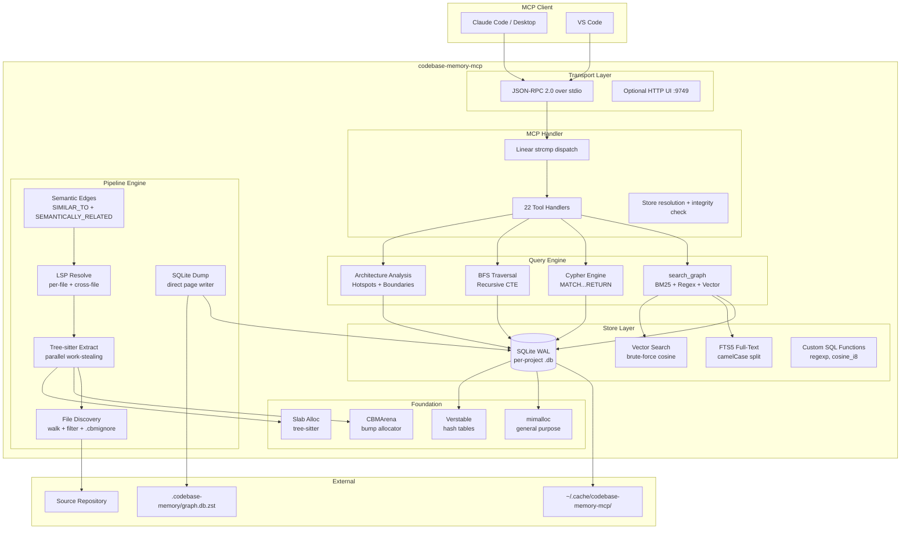
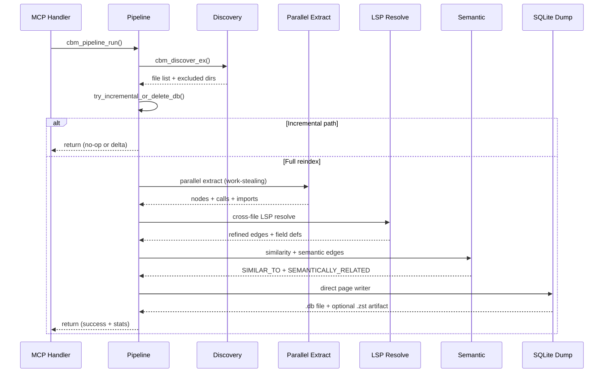
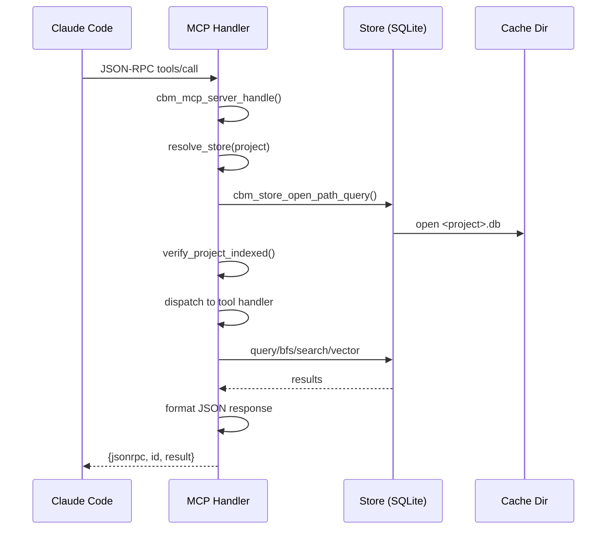

# Architecture Overview

## System Diagram



## Layer Stack

```
┌─────────────────────────────────────────────────┐
│  MCP Handler       src/mcp/                     │  JSON-RPC dispatch
│                    22 tools, resolve, auto-index │
├─────────────────────────────────────────────────┤
│  CLI               src/cli/                     │  install/update/config
├─────────────────────────────────────────────────┤
│  Cypher Engine     src/cypher/                  │  MATCH...RETURN
├─────────────────────────────────────────────────┤
│  Pipeline          src/pipeline/                │  7-phase orchestrator
│                    pass_*.c (16 passes)          │  parallel work-stealing
├─────────────────────────────────────────────────┤
│  Graph Buffer      src/graph_buffer/            │  in-memory graph
│                    7 hash table indexes          │  string intern pool
├─────────────────────────────────────────────────┤
│  Store             src/store/                   │  SQLite CRUD
│                    ~6000 lines                   │  FTS5, vector, BFS
├─────────────────────────────────────────────────┤
│  Discovery         src/discover/                │  file walk, gitignore
│                    language detection            │  .cbmignore patterns
├─────────────────────────────────────────────────┤
│  Foundation        src/foundation/              │  arena, slab, mem
│                    platform, compat, str_util    │  hash tables, logging
└─────────────────────────────────────────────────┘
```

## Data Flow: Index Pipeline



## Data Flow: Query Path



## Dependency Graph

```
foundation/          zero internal deps
  └─→ store/         depends: foundation
       └─→ graph_buffer/  depends: foundation, store structs
       └─→ cypher/        depends: store structs
            └─→ pipeline/  depends: all above + discover + extraction
                 └─→ mcp/  depends: all above
                      └─→ main.c  wires everything
```

No circular dependencies. Each layer depends only on layers below it.

## Key Files

| File | Lines | Purpose |
|------|-------|---------|
| `src/mcp/mcp.c` | ~5300 | MCP server, 22 tools, search, incidents |
| `src/store/store.c` | ~6000 | SQLite CRUD, FTS5, vector search, BFS |
| `src/pipeline/pipeline.c` | ~1200 | Pipeline orchestrator |
| `src/pipeline/pass_parallel.c` | ~2600 | Parallel extract + resolve |
| `src/graph_buffer/graph_buffer.c` | ~1600 | In-memory graph + SQLite dump |
| `src/discover/discover.c` | ~650 | File discovery + filtering |
| `src/pipeline/pass_definitions.c` | ~600 | Symbol extraction |
| `src/pipeline/pass_calls.c` | ~700 | Call resolution |
| `src/pipeline/pass_semantic_edges.c` | ~1000 | Vector embedding generation |
| `src/cypher/cypher.c` | ~4400 | Cypher parser + executor |
| `src/cli/cli.c` | ~4000 | Install/update/config CLI |
| `internal/cbm/lsp/php_lsp.c` | ~4500 | PHP LSP resolver |
| `internal/cbm/lsp/java_lsp.c` | ~3000 | Java LSP resolver |
